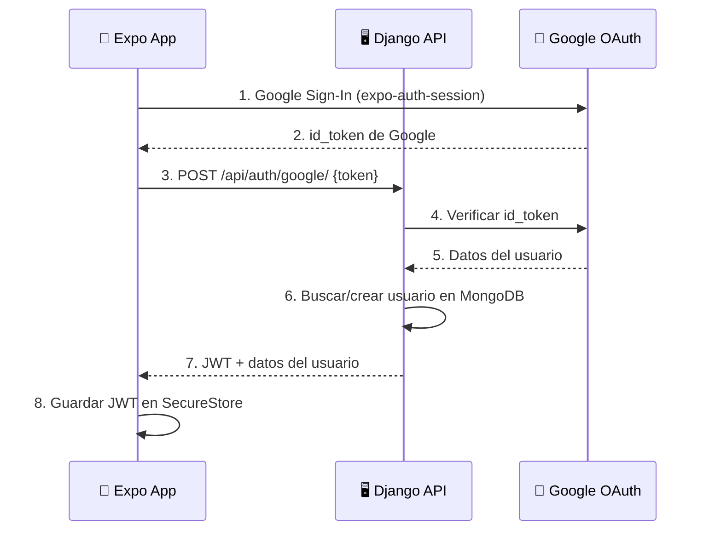

# Feature: `auth`

> Autenticación y autorización de usuarios (alumnos y admin) mediante Google OAuth + JWT.

---

## Checklist de Implementación

### 🧠 Dominio (`backend/core/domain/`)
- [ ] Entidad en `entities/user.py` — `@dataclass` con campos: id, email, name, role (Enum: STUDENT/ADMIN), avatar_url, is_active
- [ ] Puerto en `ports/user_repository.py` — `ABC` con: `find_by_id`, `find_by_email`, `save`, `update`
- [ ] Puerto en `ports/auth_provider.py` — `ABC` con: `verify_token(token) -> UserInfo`
- [ ] Excepciones: `InvalidCredentialsError`, `UserNotFoundError`

### ⚙️ Aplicación (`backend/core/application/`)
- [ ] Caso de uso `use_cases/login_with_google.py` — Verifica token Google, busca/crea usuario, devuelve JWT
- [ ] Caso de uso `use_cases/get_current_user.py` — Devuelve perfil del usuario autenticado

### 🔌 Adaptadores Backend (`backend/adapters/`)
- [ ] Modelo Mongo en `persistence/models/user_model.py`
- [ ] Repositorio en `persistence/repositories/mongo_user_repository.py`
- [ ] Proveedor Google en `adapters/auth/google_auth_provider.py` — Implementa `AuthProvider`
- [ ] Vista en `api/views/auth_views.py` — `GoogleLoginView`, `MeView`
- [ ] Serializer en `api/serializers/auth_serializer.py`
- [ ] Rutas en `api/urls.py`:
  - `POST /api/auth/google/` — Login con Google
  - `GET /api/auth/me/` — Perfil del usuario actual

### 🔧 Configuración (`backend/config/`)
- [ ] Registrar `MongoUserRepository` y `GoogleAuthProvider` en `di_container.py`
- [ ] Registrar `LoginWithGoogleUseCase` y `GetCurrentUserUseCase`
- [ ] Configurar `GOOGLE_CLIENT_ID` en `.env`

### 📱 Frontend (`frontend/`)
- [ ] Servicio en `services/authApi.ts` — `loginWithGoogle(token)`, `getMe()`
- [ ] Store en `stores/authStore.ts` — Estado: user, token, isAuthenticated, login(), logout()
- [ ] Pantalla `app/(auth)/login.tsx` — Botón de Google Sign-In
- [ ] Pantalla `app/(auth)/register.tsx` — Registro (si necesario)
- [ ] Lógica de redirección en `app/_layout.tsx` si no hay sesión

### ✅ Verificación
- [ ] `POST /api/auth/google/` devuelve JWT con token válido de Google
- [ ] `GET /api/auth/me/` devuelve perfil con JWT en header
- [ ] Login funciona en Expo Go
- [ ] Redirección a login si no hay sesión activa
- [ ] Commit y push a rama `feature/auth`

---

## Notas de Diseño

### Endpoints

| Método | Ruta                | Descripción                      |
|--------|---------------------|----------------------------------|
| POST   | `/api/auth/google/` | Login con token de Google        |
| GET    | `/api/auth/me/`     | Perfil del usuario autenticado   |

### Modelo de datos

```python
class UserRole(Enum):
    STUDENT = "student"
    ADMIN = "admin"

@dataclass
class User:
    id: str
    email: str
    name: str
    role: UserRole
    avatar_url: str = ""
    is_active: bool = True
```

### Flujo de autenticación


